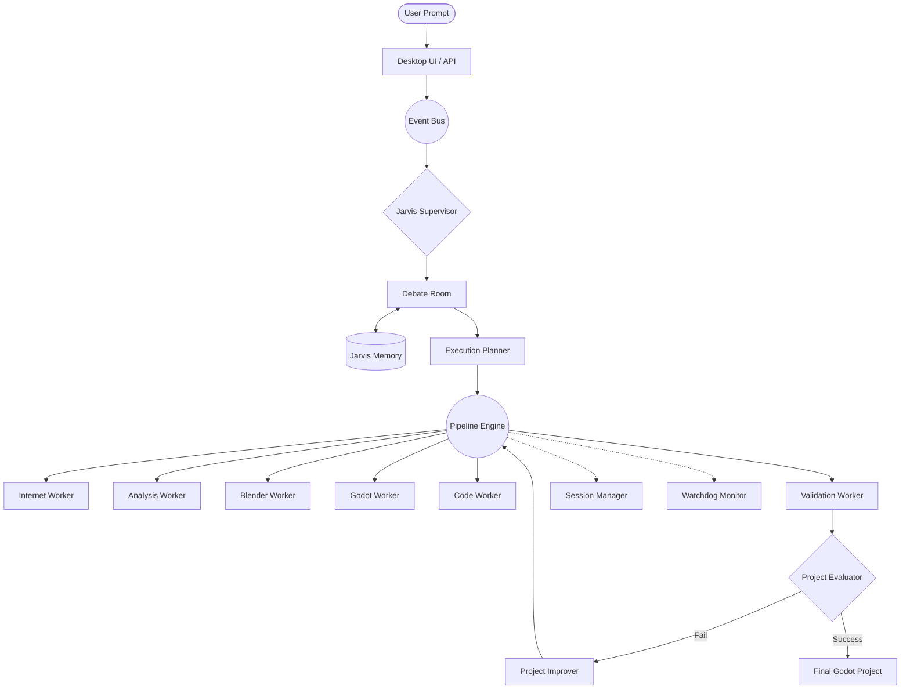
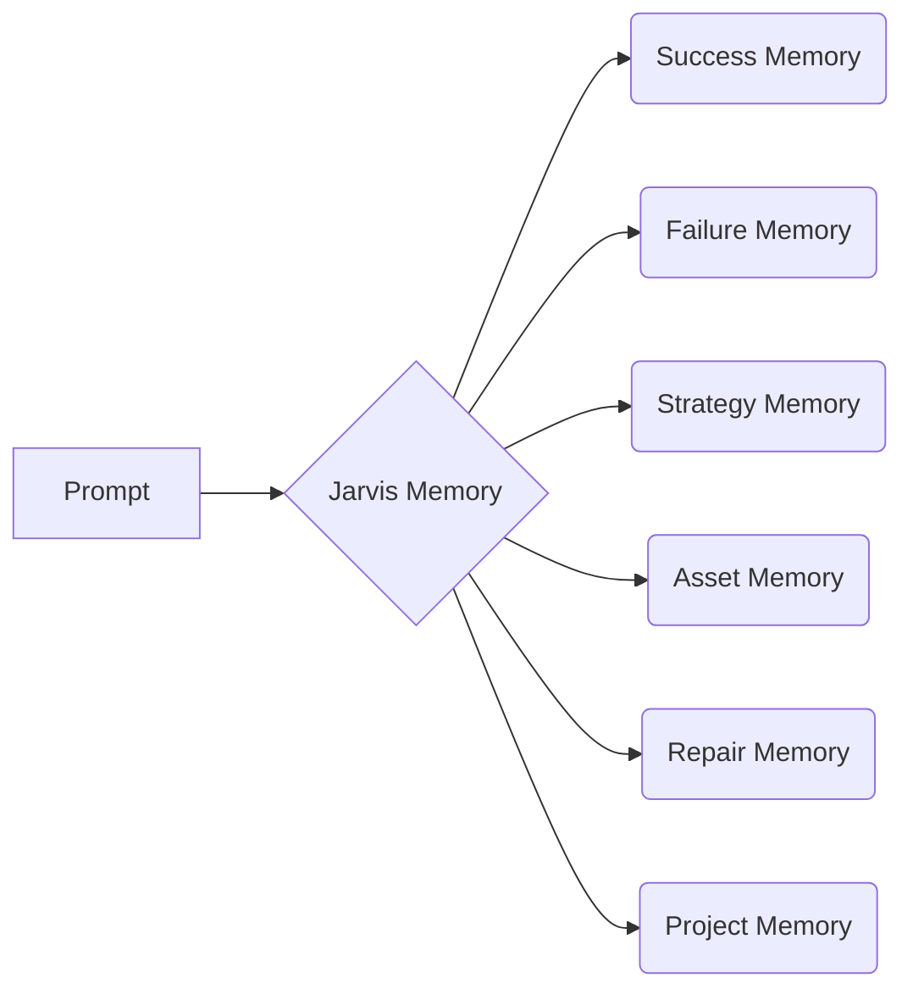
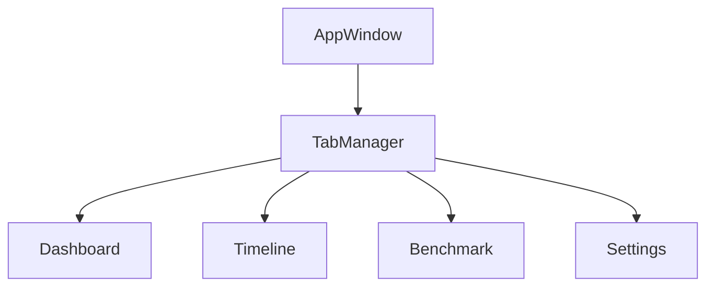

# 📘 AppSuite Jarvis V1: The Official Architecture Guide

Welcome to **AppSuite Jarvis V1**. If you're reading this, you are peering into the inner workings of an ambitious AI-driven platform designed to autonomously generate, validate, and assemble fully functional 3D video games. 

This isn't just another API wrapper. It is a **multi-agent operating system**, complete with memory, debate rooms, and hardware pipelines spanning Godot and Blender. 

Grab a coffee. Let's look at the blueprint. ☕

---

## 1. Project Vision 🌟

### What is AppSuite?
AppSuite is an **autonomous game-generation pipeline**. You give it a prompt ("Create an FPS map with realistic buildings"), and it orchestrates AI agents, web scrapers, 3D modeling software, and game engines to build a ready-to-play project.

### Why was it created?
Modern AI tools are chatbots. They give you code snippets. But game development requires *assets, scenes, physics, and compilation*. AppSuite solves this by treating the AI not as an oracle, but as a **Supervisor** of a robotic assembly line.

### The Long-Term Vision
To evolve from a static generation script into a self-improving platform that:
1. **Learns** from its mistakes.
2. **Debates** the best architectural choices before writing a line of code.
3. **Validates** its own work by booting up the game engine and testing it.

### Current Stage
We are transitioning from **Prototype** to **MVP**. The infrastructure is solid, the UI is built, but we are actively stripping away "fake mock successes" to force the system to learn from real, brutal failures.

---

## 2. High Level Architecture 🏗️

When a user interacts with AppSuite, they are talking to a massive DAG (Directed Acyclic Graph) of specialized systems.



### The "Why"
We separated the **Brain** (Supervisor/Debate) from the **Brawn** (Workers). If Blender crashes, the Brain knows how to retry or pivot to a different template.

---

## 3. Complete Folder Walkthrough 📁

A quick tour of the repository layout:

| Folder | Purpose | Execution |
|--------|---------|-----------|
| `appsuite/` | The core Python backend package. Everything lives here. | **Heart of the system** |
| `appsuite/core/` | The "Brain". Memory, Supervisor, hardware monitors, and state management. | Runs continuously |
| `appsuite/workers/` | The "Hands". Scripts that actually do things (download, compile). | Run sequentially on jobs |
| `appsuite/agents/` | AI personas for the Debate Room. | Consulted during planning |
| `appsuite/pipeline/` | The DAG orchestrator. Routes jobs between workers. | Drives execution |
| `appsuite/plugins/` | Dynamic extensions (like Sketchfab integrations). | Loaded at startup |
| `desktop_ui/` | The PySide6 frontend application. Dashboards and Timelines. | Renders to User |
| `config/` | JSON files dictating LLM providers and templates. | Read at startup |
| `tests/` | Unit and integration testing suites. | Run on CI/CD |
| `output/` | Where generated `.godot` projects are dumped. | Written by workers |

---

## 4. Every Important File 📄

Here are the heavy lifters of the codebase.

### Core Orchestration
*   **`main.py`**: The `AppContext` god-object. It wires the database, starts the watchdog, initializes memory, and boots the Supervisor.
*   **`supervisor.py`**: The foreman. Reads the job queue, consults memory, builds an execution plan, and dispatches it to the Pipeline. 
*   **`pipeline/pipeline.py`**: The assembly line. Executes workers in a specific sequence or DAG, managing inputs/outputs and catching fatal crashes.

### Memory & Intelligence
*   **`jarvis_memory.py`**: The unified facade for all 7 memory types (Success, Failure, Strategy, etc.). Saves the system from making the same mistake twice.
*   **`debate_room.py`**: Instantiates multiple AI personas (CodeAgent, AssetAgent) to argue over the best approach for a user's prompt before execution.
*   **`project_analyzer.py`**: Scans old Godot projects to extract reusable scenes and score code complexity.

### Stability & Extensibility
*   **`hardening.py`**: Houses the `SessionManager` (autosaves) and `WatchdogManager` (kills stuck threads and memory leaks).
*   **`plugin_manager.py`**: Dynamically loads custom python files from `plugins/` to inject new Workers or Website Adapters without touching core code.

---

## 5. System Flow: The Story of a Job 📖

> *"Generate an FPS map with realistic buildings."*

1. **Prompt enters UI**: The user types the prompt. The UI inserts a row into the `jobs` database table.
2. **EventBus fires**: `JOB_CREATED` echoes through the system.
3. **Supervisor wakes up**: The `Supervisor` pulls the job from the queue.
4. **Debate Room Session**: The Supervisor hands the prompt to the `DebateRoom`. 
   * *AssetAgent* says: "Use Sketchfab for realistic buildings."
   * *ReliabilityAgent* says: "Sketchfab imports failed 3 times today, use Kenney instead."
5. **Memory Consulted**: The `Planner` queries `JarvisMemory`. It sees Kenney assets have a 95% success rate for FPS maps. 
6. **Pipeline Dispatched**: The execution plan is built.
7. **Workers Execute**:
   * `InternetWorker` downloads the Kenney assets.
   * `AnalysisWorker` verifies they are GLB files.
   * `GodotWorker` builds the scene.
8. **Validation Runs**: `ValidationWorker` headlessly loads the Godot scene. It passes.
9. **Memory Updates**: The `SuccessMemory` logs the winning template and asset choices.
10. **Delivery**: The Dashboard updates to `🟢 Complete`, and the user can open their new game.

*Estimated Time: 45 to 90 seconds.*

---

## 6. Worker Documentation 🛠️

Workers are the hands of the system. They inherit from `BaseWorker` and have strict inputs and outputs.

| Worker | Responsibilities | Failure Modes | Recovery |
|--------|------------------|---------------|----------|
| **InternetWorker** | Web scraping, API fetching, Zip extraction. | 404s, Rate limits. | Retry with fallback asset source. |
| **AnalysisWorker** | Reads 3D headers, checks polycounts. | Corrupted ZIPs, unsupported formats. | Discard asset, flag in DB. |
| **BlenderWorker** | Converts formats, applies textures, bakes. | Binary missing, Python script crash, Timeout. | *Legacy:* Fake stub. *New:* Hard fail. |
| **GodotWorker** | Creates project, scenes, configures physics. | Import loops, missing dependencies. | Recreate `project.godot`. |
| **CodeWorker** | Calls LLM to write GDScript. | Syntax errors, LLM hallucinations. | Iterative compile-and-fix loop. |
| **ValidationWorker**| Boots Godot headless to check loadability. | Scene fails to load. | Triggers `ProjectImprover` loop. |

---

## 7. Memory System 🧠

AppSuite doesn't just execute; it remembers.



*   **Success Memory**: Tracks exact worker/template combinations that yielded a 100% validation score.
*   **Failure Memory**: Logs stack traces and exactly which worker crashed.
*   **Repair Memory**: "When Error X happens, Fix Y worked 90% of the time."
*   **Asset Memory**: "PolyHaven textures cause OOM errors on Low-End hardware."
*   **Project Memory**: Stores the architectural layout of generated `.tscn` files for future reuse.

---

## 8. The Debate Room 🏛️

Before writing a single file, AI agents argue.

*   **PlannerAgent**: The leader. Wants the project done fast.
*   **AssetAgent**: Wants high-poly, beautiful assets.
*   **CodeAgent**: Wants complex, robust GDScript architectures.
*   **ReliabilityAgent**: The pessimist. Vetoes risky assets and experimental code.

They cast "votes" on an execution plan. The highest-scored plan is handed to the Supervisor.

---

## 9. Database Schema 🗄️

Powered by SQLite (moving to connection pools/PostgreSQL).

*   `jobs`: The core queue. `id`, `prompt`, `status`, `stage`.
*   `events`: The timeline. Every log, warning, and step is recorded here.
*   `memory_*`: Individual tables for the memory subsystems storing JSON context.
*   `assets`: Local cache registry to prevent redownloading identical files.

---

## 10. Desktop UI Architecture 🖥️

Built in **PySide6** (Qt for Python). 

*   **Sidebar**: Persistent navigation.
*   **Dashboard**: High-level overview. Active jobs, quick stats.
*   **Timeline**: Live stream of the `EventBus`. Watch the AI think.
*   **Benchmark Page**: Real-time graphing of Success Rates and Asset Reliability.
*   **Workers Page**: Visual status of the Pipeline (Active, Idle, Failed).



---

## 11. Reliability Systems 🛡️

Because software breaks.

1.  **WorkerHealthMonitor (Preflight)**: Checks if Internet, Godot, and Blender actually exist before starting.
2.  **WatchdogManager**: Runs on a background thread. If a worker hangs for >600s, it ruthlessly terminates the thread.
3.  **SessionManager**: Autosaves the state. If the power goes out, the system resumes the DAG from the last checkpoint.
4.  **Job Sandboxing**: Failed jobs have their temporary folders (`temp/job-id/`) wiped clean so the disk doesn't fill up with garbage.

---

## 12. Plugin Architecture 🔌

Want to add a Sketchfab downloader? Drop a `.py` file in `/plugins`.

```python
# plugins/sketchfab_plugin.py
class SketchfabAdapter(WebsiteAdapter):
    # logic here...

def register(context):
    return {
        "name": "Sketchfab",
        "adapters": [SketchfabAdapter()]
    }
```
The `PluginManager` loads it at boot, and suddenly the Debate Room knows how to talk to Sketchfab.

---

## 13. Current Completion Status 📊

*Brutally Honest Numbers:*

*   Infrastructure: **80%** (Solid DAG, Queue, and Events)
*   Desktop UI: **75%** (Looks great, needs deeper interactivity)
*   Memory System: **55%** (Recording is flawless; Retrieval/Influence is WIP)
*   Debate Room: **55%** (Architected, needs prompt tuning)
*   Browser Agent: **40%** (Adapters exist, DOM parsing is basic)
*   Reliability: **35%** (Moving away from mock successes to hard truth)
*   Production Readiness: **25%** (Needs DB refactor and security patches)

**Overall MVP Status: ~55%**

---

## 14. Known Problems ⚠️

1.  **Fake Reliability**: Legacy code falls back to "ASCII FBX stubs" when Blender fails. This is being actively purged. We want real failures, not fake successes.
2.  **SQLite Locking**: High concurrency causes `database is locked`. We are migrating to connection pooling.
3.  **Security**: Config files hold plaintext API keys. Needs `.env` migration.

---

## 15. Future Roadmap 🗺️

### Phase 1 & 2: Stabilization & Truthfulness (Next 2 Weeks)
*   Purge all mock generators.
*   Implement Job Sandboxing.
*   Migrate secrets to `.env`.
*   Fix SQLite concurrency.

### Phase 3, 4, 5: True Autonomy & Polish (Next 2 Months)
*   Supervisor Memory Integration (letting past failures alter future plans).
*   Real headless Godot validation (compiling scenes to test them).
*   Automated Integration Testing on commits.
*   Dashboard Telemetry (Tokens, time, memory usage).

### Production Freeze
*   No new features. Just bug fixes, weird edge cases, scaling, and documentation.

---

## 16. Glossary 📚

*   **Job**: A single user request (e.g., "Make a game").
*   **Worker**: A concrete script that performs a hardware/network task.
*   **DAG**: Directed Acyclic Graph. How tasks are routed (non-linearly).
*   **Template**: A JSON blueprint dictating how a specific game genre is structured.
*   **Checkpoint**: A snapshot of pipeline state allowing crash recovery.
*   **Stub**: A fake file generated to bypass an error (being deprecated).
*   **EventBus**: The central nervous system where logs and statuses are broadcast.

---

*This document is the living truth of AppSuite Jarvis V1. Read it, respect it, and help us build the future of game generation.* 🚀
