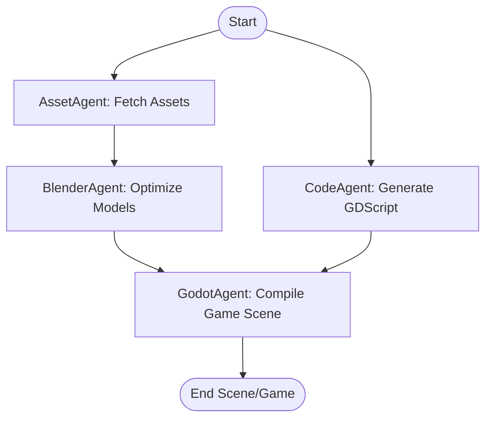

# 🌌 AppSuite Jarvis v2

AI-powered 3D asset generation, quality validation, and Godot scene content pipeline. Using a natural-language prompt, AppSuite Jarvis autonomously searches/generates 3D assets, processes/validates them, builds scene layouts, and compiles a fully playable Godot game scene complete with real collision shapes, cameras, lights, and generated controls.

```
       [Natural Language Prompt]
                  │
                  ▼
         [Jarvis Brain / Plan]
                  │
                  ▼
       [Agent Coordinator DAG]
     ┌────────────┼────────────┐
     ▼            ▼            ▼
[AssetAgent] [CodeAgent]  [BrowserAgent]
     │            │            │
     └───────────┬┘            │
                 ▼             ▼
          [BlenderAgent]       │
                 │             │
                 ▼             ▼
           [GodotAgent] ◄──────┘
                  │
                  ▼
         [Playable Godot Game]
```

---

## 🚀 1. Quick Start

### Prerequisites
* **Python**: Python 3.10+ (recommended: Python 3.12/3.13)
* **Godot**: Godot 4.x (configured in `config/config.json`)
* **Blender**: Blender 4.x or 5.x (configured in `config/config.json`)

### Installation & Initialization
Configure Python virtual environment and database:
```powershell
# Install requirements
python -m pip install -r requirements.txt

# Initialize SQLite database
python scripts/init_db.py
```

### Running the API Server
Start the FastAPI REST API:
```powershell
python -m appsuite.main
```
* **API Documentation**: Live at `http://localhost:8000/docs`

### Executing E2E FPS Game Benchmark
Validate the orchestrator, providers, and agents under real workloads:
```powershell
python tests/benchmark_fps.py
```
This runs 3 consecutive FPS game generation jobs, verifies generated scenes/scripts, monitors LLM API costs/token counts, and creates a JSON report `benchmark_report.json`.

---

## 🛠️ 2. Dynamic Graph Orchestrator (`appsuite/graph/`)

AppSuite features a **LangGraph-inspired dynamic execution engine** replacing the legacy linear state machine. It schedules specialized agents and runs tasks in parallel using a dependency-resolved DAG.



### State Management (`graph/state.py`)
State tracking uses `GraphState` wrapping `JobState`, carrying:
* `job`: Dict containing the prompt and identifiers.
* `current_node`: String representing the currently executing node.
* `worker_result`: Node results status (`WorkerResult`).
* `pipeline_state`: Serialized/deserialized `JobState` instance carrying ground, lights, assets, and paths.

### Crash Recovery & Checkpointing
If execution fails or is interrupted:
* Successful nodes are persisted in `<job_id>_dag_checkpoint.json`.
* The full `pipeline_state` is serialized to the checkpoint using `JobState.as_dict()`.
* On pipeline retry, completed nodes are skipped, and the state is fully reconstructed back to a `JobState` instance to prevent losing assets or script references.
* **Infinite loop protection**: Graph nodes are restricted to a maximum of 3 retries before aborting.

---

## 🤖 3. Multi-Agent Specialization Layer (`appsuite/agents/`)

The pipeline operates on a decentralized multi-agent hierarchy governed by `AgentCoordinator`:

* **Agent Orchestration Contract**: Every agent receives a unified `AgentTask` schema and returns an `AgentResult` object.
* **Agent Types**:
  * **AssetAgent**: Searches online asset registries, downloads zip archives, verifies file sizes, and parses models.
  * **CodeAgent**: Prompts the LLM provider to write character controls and game loop scripts in GDScript.
  * **BlenderAgent**: Headless optimization, mesh scaling, material assignment, and scene layout assembly.
  * **GodotAgent**: Imports models, spawns environment nodes, compiles `.tscn` files, and validates them.
  * **BrowserAgent**: Crawls online documentation (e.g., DuckDuckGo scraping) to resolve script compilation errors.

### Universal Self-Correction Loops
When `CodeAgent` generates scripts (e.g. `player.gd`), it compiles them headlessly using the local Godot binary:
```powershell
godot --headless --path <project_dir> --check-only
```
If errors are returned (non-zero exit code), the agent enters a self-correction loop, sending the error tracebacks and failing code blocks back to the LLM to patch the script. If the retry threshold is reached, it falls back to a rules-based pre-validated playable FPS template script.

---

## 🔌 4. Provider Manager & Token Banker (`core/`)

LLM queries and text/code generation are handled via a unified provider gateway:
* **Multiple Adapters**: Supported out-of-the-box: OpenAI, Gemini, Claude, and Local Model Adapters.
* **Automatic Failover**: If a provider fails due to a rate limit or API timeout, `ProviderManager` falls back to the next configured API provider.
* **Cost & Token Tracking**: Keeps granular statistics on input tokens, output tokens, pricing rates, and call frequency.
* **Fail-Safe Fallback**: If all configured APIs are unreachable, a local rules-based template generator constructs working FPS controller scripts to prevent pipeline failures.

---

## 🛡️ 5. Production Reliability Hardening (Recent Fixes)

To guarantee that AppSuite works autonomously without human intervention under real workloads, the pipeline includes several hardening layers:

> [!IMPORTANT]
> **TSCN Format Order Compliance**
> Godot scene files require all `[ext_resource]` tags to precede `[sub_resource]` tags, which in turn must precede `[node]` tags. Our `GodotWorker` splits generation buffers to enforce this structure, resolving `Parse Error: Unknown tag 'ext_resource'` errors inside Godot.

> [!NOTE]
> **Windows Path Unicode Encoding**
> When running Python on Windows under non-UTF-8 local terminals, printing or logging files inside directories with Thai characters (`เอกสาร`) can raise `UnicodeEncodeError`. The entry points `run_jarvis.py` and `benchmark_fps.py` reconfigure `sys.stdout` and `sys.stderr` to UTF-8 on startup to prevent encoding crashes.

> [!TIP]
> **Soft Resource Watermarks**
> High RAM usage (>90%) could pause DAG tasks indefinitely. We added a 15-second timeout on resource gate blocks, ensuring heavy Blender/Godot nodes warningly proceed under RAM constraints instead of hanging.

---

## ⚙️ 6. System Configurations (`config/config.json`)

Set up paths to Godot and Blender executable binaries in `config/config.json`:
```json
{
  "workers": {
    "blender": {
      "enabled": true,
      "binary": "C:/Program Files/Blender Foundation/Blender 5.1/blender.exe",
      "headless": true
    },
    "godot": {
      "enabled": true,
      "binary": "C:/Users/91629/OneDrive/เอกสาร/Desktop/godot-master/Godot_v4.6.2-stable_win64.exe",
      "headless": true
    }
  }
}
```
If `psutil` reports available system memory dropping under 10MB during startup, a health warning is logged, protecting system processes.
