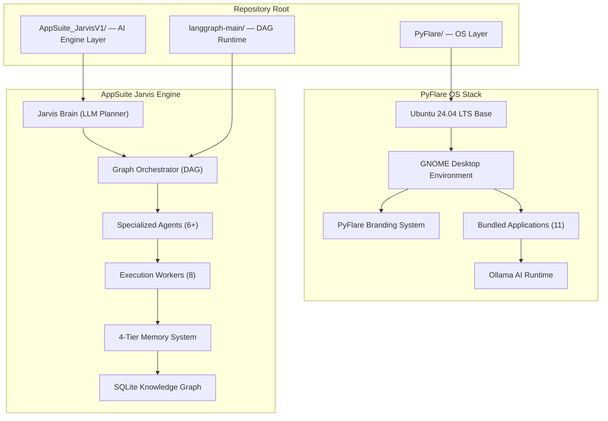
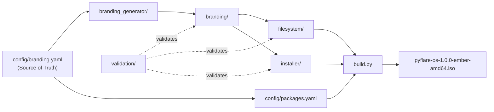

# PyFlare OS — Architecture

**Version:** 1.0.0 (Ember)
**Status:** Production
**Author:** Aachman Studios
**Last Updated:** 2026-08-04

---

## Table of Contents

1. [Overview](#overview)
2. [High-Level Architecture](#high-level-architecture)
3. [Subsystem Breakdown](#subsystem-breakdown)
4. [Component Dependency Graph](#component-dependency-graph)
5. [Data Flow](#data-flow)
6. [Build Architecture](#build-architecture)
7. [Application Framework Architecture](#application-framework-architecture)
8. [AI Integration Architecture](#ai-integration-architecture)
9. [Design Principles](#design-principles)
10. [Related Documents](#related-documents)

---

## Overview

PyFlare OS is a custom Linux distribution built on Ubuntu 24.04 LTS (Noble Numbat). The system is structured as a multi-layer stack: a remastered Ubuntu base, a GNOME desktop layer with custom branding and configuration, a set of bundled PyFlare applications, and an AI runtime integration layer powered by Ollama.

The repository is split into two primary sub-projects:

| Sub-project | Role |
|---|---|
| **PyFlare/** | The operating system itself — build pipeline, branding, filesystem, packages, installer |
| **AppSuite_JarvisV1/** | The autonomous AI engineering engine that powers the `AppSuite` application suite within the OS |

---

## High-Level Architecture



---

## Subsystem Breakdown

### 1. Base System Layer

| Component | Implementation |
|---|---|
| Base distribution | Ubuntu 24.04.2 LTS (Noble Numbat) |
| Kernel | `linux-generic-hwe-24.04` |
| Init system | systemd |
| Architecture | amd64 (x86_64) |
| ISO flavor | Live/Install DVD |
| Bootloader | GRUB 2 (BIOS + EFI) |

The base system is sourced from `ubuntu-24.04.2-live-server-amd64.iso` and remastered. The live ISO is extracted, a chroot environment is created, packages are installed/removed, overlay files are injected from `filesystem/`, and a new `filesystem.squashfs` is generated.

### 2. Desktop Environment Layer

PyFlare OS ships GNOME Shell as its primary desktop environment.

| Component | Details |
|---|---|
| Shell | GNOME Shell (latest for Ubuntu 24.04) |
| Display manager | GDM3 |
| Session type | Wayland (X11 fallback) |
| GTK version | GTK 4 (primary), GTK 3 (legacy compat) |
| gsettings overrides | `filesystem/etc/dconf/db/local.d/` |
| Application menu | Custom XDG menus via `desktop/menus/` |
| Dock | GNOME Dash-to-Dock configuration in `desktop/dock/` |

### 3. Branding System

The branding system is the most sophisticated subsystem in the repository. It is a fully automated, procedural visual identity generator.

```
branding_generator/
├── main.py           — CLI entry point and pipeline orchestrator
├── config.py         — Brand color tokens and configuration constants
├── themes.py         — GTK3/4 + GNOME Shell CSS theme generation
├── icons.py          — Full XDG icon theme (800+ SVG/PNG icons)
├── wallpapers.py     — 4K wallpaper generation (abstract flame motifs)
├── cursors.py        — X11 cursor theme generation
├── fonts.py          — Font manifest and installation helpers
├── animations.py     — Plymouth boot animation script generation
├── sounds.py         — Notification sound schema
├── exporters.py      — Cross-format export (PNG, ICO, ICNS, WebP)
├── manifest.py       — Brand manifest JSON generation
├── previews.py       — Preview sheet generation
├── extras.py         — Badge, social card, favicon generation
├── utils.py          — Shared drawing primitives (Cairo)
├── validator.py      — Post-generation validation
└── docs.py           — Auto-generated branding documentation
```

**Generated output** lands in `branding/` with 24 sub-directories covering every visual category needed by the OS.

### 4. Package System

Packages are defined in `config/packages.yaml` and are organized into logical groups:

| Group | Purpose |
|---|---|
| `base` | Core system, kernel, bootloader |
| `desktop` | GNOME Shell, GDM3, core GNOME apps |
| `graphics` | Xorg, Mesa, NVIDIA/AMD/Intel drivers |
| `audio` | PipeWire, WirePlumber, PulseAudio compat |
| `networking` | NetworkManager, WPA supplicant, OpenSSH |
| `development` | Python 3, GCC, Git, build tools |
| `containers` | Docker, Flatpak |
| `pyflare` | Python bindings for GTK4/libadwaita |
| `utilities` | Vim, timeshift, gdebi |

Beyond APT packages, the system also manages Snap packages and Flatpak applications from Flathub.

### 5. Filesystem Overlay

The `filesystem/` directory mirrors a Linux root filesystem and is overlaid onto the base Ubuntu rootfs during the build.

```
filesystem/
├── boot/          — GRUB theme, Plymouth splash
├── etc/           — systemd units, dconf overrides, os-release, hosts
├── home/          — Default user skeleton (.config, .local)
├── opt/           — PyFlare application bundles
├── root/          — Root user configuration
└── usr/           — Shared data, icons, themes, fonts, applications
```

### 6. Installer

PyFlare OS ships with a Calamares-based graphical installer.

| Component | Path | Purpose |
|---|---|---|
| Installer config | `installer/config/` | Calamares YAML modules |
| Branding | `installer/` | Product name, logo, colors for installer UI |
| Slides | `installer/slides/` | Installation slideshow HTML/CSS/JS |

### 7. Validation System

14 automated validators cover every asset category:

| Validator | Checks |
|---|---|
| `validate_boot.py` | GRUB config, Plymouth theme integrity |
| `validate_branding.py` | Logo, icon, wallpaper file presence |
| `validate_configs.py` | YAML/JSON schema correctness |
| `validate_desktop.py` | Desktop files, autostart entries |
| `validate_desktop_entries.py` | XDG `.desktop` file syntax |
| `validate_filesystem.py` | Required paths in overlay |
| `validate_icons.py` | Icon theme completeness |
| `validate_json.py` | JSON parse validation |
| `validate_packages.py` | Package name and format checking |
| `validate_permissions.py` | File permission correctness |
| `validate_services.py` | systemd unit file syntax |
| `validate_svg.py` | SVG namespace and structure |
| `validate_theme.py` | GTK theme file completeness |
| `validate_wallpapers.py` | Wallpaper resolution requirements |

---

## Component Dependency Graph



---

## Data Flow

### Build Pipeline Data Flow

```
1. config/branding.yaml
       ↓ read by
2. branding_generator/main.py
       ↓ generates
3. branding/ (800+ assets: SVG, PNG, CSS, INI, cursor theme)
       ↓ copied by scripts/copy_branding.py into
4. filesystem/usr/share/ (icons, themes, wallpapers, fonts)
       ↓ overlaid onto
5. build/rootfs/ (Ubuntu base extracted + chrooted)
       ↓ squashfsd by
6. build/filesystem.squashfs
       ↓ packed into
7. build/iso_extracted/ (GRUB, EFI, casper/)
       ↓ xorrisoed into
8. pyflare-os-1.0.0-ember-amd64.iso
```

### Boot Data Flow

```
BIOS/UEFI firmware
    ↓
GRUB 2 bootloader (PyFlare themed)
    ↓
Linux kernel (linux-generic-hwe-24.04) + initramfs
    ↓
Plymouth boot splash (pyflare theme, animated)
    ↓
systemd (PID 1) — unit activation
    ↓
GDM3 display manager
    ↓
GNOME Shell session
    ↓
Autostart services (PyFlare Engine, AI Assistant daemon)
    ↓
User desktop
```

---

## Build Architecture

See [BUILD_PIPELINE.md](BUILD_PIPELINE.md) for the complete build pipeline reference.

The primary build entry point is `build.py`, which is a 39 KB Python orchestration script providing:

- Ubuntu base ISO download with mirror fallback
- ISO extraction (`iso_extracted/`)
- chroot environment setup
- Package installation via APT
- Branding overlay injection
- squashfs generation
- ISO remastering with GRUB/EFI

---

## Application Framework Architecture

PyFlare bundles 11 application stubs under `applications/`:

```
applications/
├── ai-assistant/      — On-device AI chat (Ollama backend)
├── appsuite/          — AppSuite Jarvis IDE integration
├── browser/           — Privacy-focused web browser
├── engine/            — PyFlare Engine service
├── files/             — AI file manager
├── launcher/          — Application launcher
├── package-manager/   — Unified APT/Flatpak/Snap UI
├── plugin-manager/    — Plugin management UI
├── settings/          — System settings panel
├── store/             — Application marketplace
└── terminal/          — GPU-accelerated terminal with AI completions
```

These are currently stubs providing launchers, desktop files, and configuration skeletons. Full GTK4 implementations are planned for PyFlare OS v1.1.0 (Flare).

---

## AI Integration Architecture

The AI layer of PyFlare OS is provided by two components working together:

1. **Ollama** — local AI model runtime, installed at the OS level via `config/packages.yaml` custom installs. Provides an OpenAI-compatible HTTP API at `localhost:11434`.
2. **AppSuite Jarvis** — the orchestration engine (`AppSuite_JarvisV1/`) that wraps Ollama and multiple LLM providers (NVIDIA NIM, OpenAI) with a multi-agent DAG execution system.

See [AI_ARCHITECTURE.md](AI_ARCHITECTURE.md) for the complete AI subsystem reference.

---

## Design Principles

| Principle | Application |
|---|---|
| **Single Source of Truth** | `config/branding.yaml` drives all product identity — names, URLs, colors, versions |
| **Procedural Asset Generation** | All visual assets are code-generated, not hand-crafted. Reproducible via `branding_generator` |
| **Separation of Concerns** | Build logic, branding, filesystem, packages, and installer are independent subsystems |
| **Validation First** | Every build stage is validated by dedicated validators before downstream stages run |
| **Linux Standards Compliance** | All paths follow XDG Base Directory Specification and FHS |
| **Dual Boot Target** | Both legacy BIOS and modern UEFI are supported in every build |

---

## Related Documents

| Document | Purpose |
|---|---|
| [SYSTEM_OVERVIEW.md](SYSTEM_OVERVIEW.md) | Non-technical system overview |
| [BUILD_PIPELINE.md](BUILD_PIPELINE.md) | Detailed build pipeline reference |
| [BOOT_PROCESS.md](BOOT_PROCESS.md) | Boot sequence from BIOS to desktop |
| [BRANDING.md](BRANDING.md) | Visual identity system |
| [FILESYSTEM.md](FILESYSTEM.md) | Filesystem overlay structure |
| [AI_ARCHITECTURE.md](AI_ARCHITECTURE.md) | AI subsystem and Jarvis engine |
| [PLUGIN_SYSTEM.md](PLUGIN_SYSTEM.md) | Plugin architecture |
| [INSTALLER.md](INSTALLER.md) | Calamares installer configuration |
