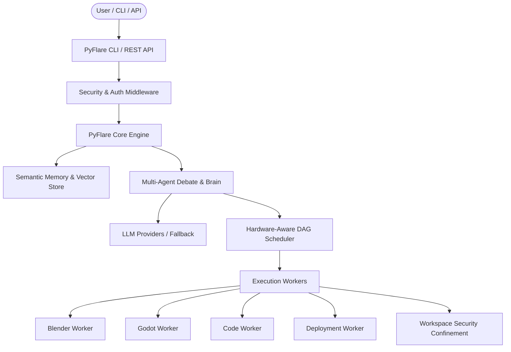

# PyFlare

[](https://github.com/aachman52/Appsuite/actions/workflows/ci.yml)
[](https://www.python.org/)
[](LICENSE)
[](https://github.com/astral-sh/ruff)

**PyFlare** is a modular, production-ready autonomous AI agent orchestration and development platform. It coordinates multi-agent cognitive reasoning, resilient tool execution pipelines, semantic memory retrieval, and 3D / software asset generation with built-in self-healing and security confinement.

---

## 🏛️ Architecture Overview

PyFlare uses a layered, decoupled architecture with a canonical source tree under `src/pyflare/`:

```
pyflare/
├── agents/       # Multi-agent role specializations (Asset, Blender, Code, Godot, Browser, Coordinator)
├── api/          # FastAPI REST API, auth dependencies, rate limiting, security middleware
├── core/         # Engine core, DAG orchestrator, state management, security sandboxing, database
├── memory/       # Semantic memory, episodic vector embeddings, procedural memory, strategy recall
├── pipeline/     # DAG execution pipeline, asset router, asset registry, GLTF/FBX normalizers
├── plugins/      # Extensible plugin system and hook lifecycle managers
├── providers/    # Multi-LLM provider client (OpenAI, Gemini, Anthropic, NVIDIA NIM, Local rules fallback)
├── scheduler/    # Dynamic hardware-aware scheduler, resource monitor, worker scoring
└── workers/      # Resilient task execution workers (Blender, Godot, Code, Deploy, Validation)
```



---

## 🚀 Quick Start

### 1. Installation

Clone the repository and install PyFlare in editable mode with development dependencies:

```bash
git clone https://github.com/aachman52/Appsuite.git
cd Appsuite
python -m pip install -e .[dev]
```

### 2. Environment Configuration

Copy the example environment template:

```bash
cp .env.example .env
```

Configure your optional provider keys or keep defaults for local rule-based execution.

### 3. Run System Diagnostics

Check your environment, third-party binary paths (Blender, Godot, FFmpeg, Git), and security status:

```bash
pyflare doctor
```

---

## 💻 CLI Usage

PyFlare includes an intuitive command-line interface:

### Plan Execution (Dry Run Preview)
Inspect the generated multi-stage DAG, template assignment, and estimated resource requirements:
```bash
pyflare plan "Build an enchanted medieval watchtower scene"
```

### Start API Server
Launch the hardened FastAPI server (bound to localhost by default):
```bash
pyflare serve --host 127.0.0.1 --port 8000
```

### Direct Job Execution
Execute an autonomous run end-to-end from the terminal:
```bash
pyflare run "Generate low-poly dungeon crawler assets"
```

---

## 🔒 Security Hardening

PyFlare is built with security as a first-class requirement:

- **Workspace Path Confinement:** All file access from workers is validated using canonical path resolution (`pyflare.core.security.resolve_workspace_path`) to prevent directory traversal attacks (`../` and null bytes).
- **Safe Command Allowlist:** Subprocess execution is restricted to allowlisted executables without `shell=True` (`pyflare.core.security.run_safe_command`).
- **Secret Redaction:** Logs, error messages, and debug dumps automatically scrub API keys, bearer tokens, and credentials via `pyflare.core.security.redact_secrets`.
- **API Authentication:** Protected endpoints require `X-API-Key` or `Authorization: Bearer <token>` when enabled.
- **Localhost Default Binding:** Web services bind to `127.0.0.1` to prevent accidental public network exposure.
- **Safe Worker Defaults:** Network deployment workers (such as FTP uploads) are disabled by default.

---

## 🧪 Testing & Quality

Run the test suite across unit and integration categories:

```bash
# Run unit tests
pytest tests/unit

# Run unit tests with coverage
pytest tests/unit --cov=pyflare --cov-report=term

# Run integration tests
pytest tests/integration

# Run Ruff linter
python -m ruff check .

# Run mypy type checking
python -m mypy src/pyflare --explicit-package-bases
```

---

## 📄 License

This project is licensed under the MIT License — see the [LICENSE](LICENSE) file for details.
