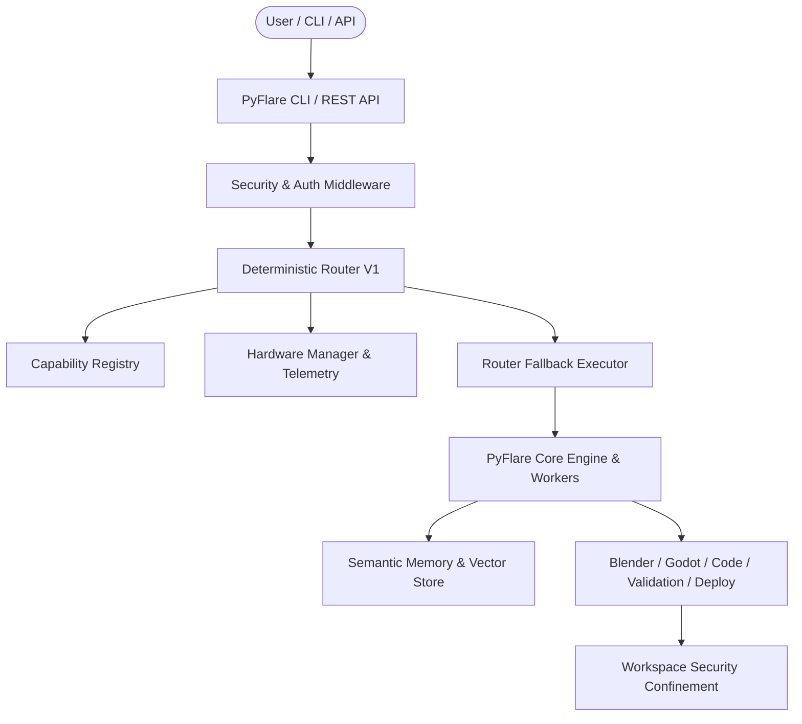

# PyFlare

[](https://github.com/aachman52/Appsuite/actions/workflows/ci.yml)
[](https://www.python.org/)
[](LICENSE)
[](https://github.com/astral-sh/ruff)

**PyFlare** is a modular autonomous AI agent orchestration and development platform. It coordinates deterministic capability-based routing, hardware-aware worker dispatch, semantic memory retrieval, and 3D / software asset generation with built-in self-healing and security confinement.

---

## 🚦 Component Status Matrix

| Component | Status | Description |
| :--- | :--- | :--- |
| **Deterministic Router V1** | `Implemented` | 100% deterministic scoring, Bayesian history, privacy & cloud filtering, stable tie-breaking |
| **Capability Registry** | `Implemented` | Central registry for cloud models, local models, MCP tools, and worker nodes |
| **Hardware Profiler** | `Implemented` | Non-blocking CPU, RAM, VRAM, disk, binary detection and normalized tiers |
| **Workspace Security Confinement** | `Implemented` | Path traversal protection, shell injection prevention, secret redaction |
| **FastAPI REST API & Auth** | `Implemented` | Strict API key authentication by default, rate limiting, and localhost binding |
| **Multi-Agent Pipeline & DAG** | `Implemented` | Multi-stage asset creation, code generation, and validation pipelines |
| **Semantic Strategy Memory** | `Experimental` | Vector recall and strategy similarity evaluation |
| **Context Manager** | `Experimental` | Baseline context tracking; advanced long-horizon compaction in progress |
| **Distributed Workers** | `Planned` | Multi-node worker clustering and remote task queues |
| **Shared Enterprise Asset Store**| `Planned` | Global distributed object cache and cross-project asset deduplication |
| **PyFlare OS Linux Distribution** | `Offline Validation Only` | ISO generation requires Linux tooling and is deferred; offline source validation enabled |

---

## 🏛️ Architecture Overview

PyFlare uses a layered, decoupled architecture with a canonical source tree under `src/pyflare/`:

```
pyflare/
├── agents/       # Multi-agent role specializations (Asset, Blender, Code, Godot, Browser, Coordinator)
├── api/          # FastAPI REST API, auth dependencies, rate limiting, security middleware
├── core/         # Engine core, DAG orchestrator, state management, security sandboxing, database
├── memory/       # Semantic memory, episodic vector embeddings, procedural memory, strategy recall
├── pipeline/     # DAG execution pipeline, asset router, asset registry, GLTF/FBX normalizers
├── plugins/      # Extensible plugin system and hook lifecycle managers
├── providers/    # Multi-LLM provider client (OpenAI, Gemini, Anthropic, NVIDIA NIM, Local rules fallback)
├── router/       # Deterministic routing engine, capability registry, executor, Bayesian history
├── scheduler/    # Dynamic hardware-aware scheduler, resource monitor, worker scoring
└── workers/      # Resilient task execution workers (Blender, Godot, Code, Deploy, Validation)
```



---

## 🚀 Quick Start

### 1. Installation

Clone the repository and install PyFlare in editable mode with development dependencies:

```bash
git clone https://github.com/aachman52/Appsuite.git
cd Appsuite
python -m pip install -e .[dev]
```

### 2. Environment Configuration

Copy the example environment template:

```bash
cp .env.example .env
```

Configure your optional provider keys or keep defaults for local rule-based execution.

### 3. Run System Diagnostics

Check your environment, third-party binary paths (Blender, Godot, FFmpeg, Git), and security status:

```bash
pyflare doctor
```

---

## 💻 CLI Usage

### Deterministic Routing Plan
Preview deterministic route selection, score breakdown, hardware constraints, and ordered fallbacks:
```bash
pyflare route "Generate a 3D procedural tree"
pyflare route "Write a Python parser" --local-only
```

### Inspect Hardware Telemetry
View detected CPU cores, RAM headroom, GPU VRAM, and binary availability:
```bash
pyflare hardware
```

### List Registered Capabilities
View all registered candidate providers, latency estimates, cost metrics, and availability:
```bash
pyflare capabilities
```

### Plan Execution (Pipeline Preview)
Inspect the generated multi-stage DAG, template assignment, and estimated resource requirements:
```bash
pyflare plan "Build an enchanted medieval watchtower scene"
```

### Start API Server
Launch the hardened FastAPI server (bound to localhost by default):
```bash
pyflare serve --host 127.0.0.1 --port 8000
```

### Validate PyFlare OS Source Tree
Run lightweight static validation of PyFlare OS source assets, theme, and package manifests without heavy ISO remastering:
```bash
pyflare validate-os
```

---

## 🔒 Security Hardening

- **Workspace Path Confinement**: Filesystem access is strictly restricted within the designated workspace directory. Attempts to escape via directory traversal (`../`) or null bytes (`\0`) are immediately blocked.
- **Safe Subprocess Execution**: Subprocesses are executed without shell expansion (`shell=False`) using strictly sanitized argument vectors.
- **Secret Redaction**: API keys and credential strings are automatically redacted from error traces and logs.
- **Strict Default Authentication**: The FastAPI API server rejects unauthenticated requests with HTTP 401 Unauthorized unless `PYFLARE_REQUIRE_AUTH=false` is explicitly configured.
- **Safe Network Bindings**: Default server binding is strictly confined to `127.0.0.1`.

---

## 📄 License

PyFlare is licensed under the [MIT License](LICENSE).
