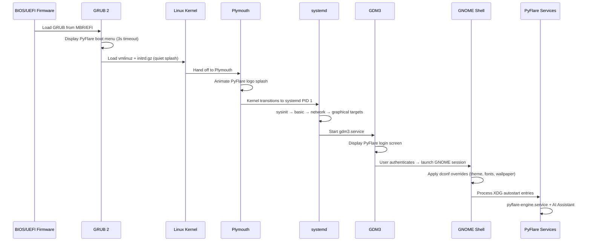

# AppSuite Ecosystem — Boot Process

**Version:** 1.0.0 | **Status:** Production | **Author:** Aachman Studios | **Last Updated:** 2026-08-04

---

## Overview

PyFlare OS follows the standard modern Linux boot path: UEFI/BIOS → GRUB 2 → Linux kernel + initramfs → Plymouth splash → systemd → GDM3 → GNOME Shell → PyFlare services.

Both **BIOS (legacy)** and **UEFI** boot modes are supported. Secure Boot is planned for v2.0.0 (Ignite).

---

## Boot Sequence Diagram



---

## Stage 1: Firmware

| Item | Details |
|---|---|
| BIOS mode | MBR partition, GRUB installed to MBR (`boot_hybrid.img`) |
| UEFI mode | GPT partition, `grubx64.efi` in `/EFI/BOOT/` |
| Shim | `shimx64.efi` for Secure Boot-ready hardware (passive) |
| ISO hybrid | Both BIOS and UEFI boot from the same ISO |

---

## Stage 2: GRUB 2

PyFlare ships a custom GRUB theme generated by `branding_generator/themes.py`.

**GRUB kernel parameters:**
```
linux /casper/vmlinuz boot=casper quiet splash ---
initrd /casper/initrd.gz
```

- `quiet` — suppresses kernel messages
- `splash` — activates Plymouth
- `---` — separates kernel params from init params

**GRUB menu entries:**
1. PyFlare OS (default, 3s timeout)
2. PyFlare OS Recovery Mode
3. UEFI Firmware Settings (UEFI only)
4. memtest86+

---

## Stage 3: Kernel and initramfs

| Item | Value |
|---|---|
| Kernel | `linux-generic-hwe-24.04` |
| Image | `/casper/vmlinuz` |
| initramfs | `/casper/initrd.gz` |
| Root filesystem | `casper/filesystem.squashfs` (Live) |

The casper scripts in the initramfs:
1. Mount `filesystem.squashfs` read-only
2. Create tmpfs for writes
3. Set up overlayfs (squashfs + tmpfs)
4. Pivot root to the live session

---

## Stage 4: Plymouth

Plymouth provides the animated boot splash. PyFlare ships a custom `pyflare` theme.

```
filesystem/usr/share/plymouth/themes/pyflare/
├── pyflare.plymouth      Theme metadata
├── pyflare.script        Animation logic (generated by animations.py)
└── images/               Logo, progress bar, background
```

The animation shows the PyFlare logo centred on a dark background with an animated progress bar in the brand accent colour.

---

## Stage 5: systemd

systemd activates services in dependency order:

```
sysinit.target   → udev, filesystems, kernel subsystems
basic.target     → dbus, udev settled
network.target   → NetworkManager, systemd-resolved
multi-user.target → non-graphical services
graphical.target  → GDM3, PyFlare Engine, Ollama
```

**PyFlare custom units (in `filesystem/etc/systemd/system/`):**
- `pyflare-engine.service` — PyFlare Engine daemon
- `ollama.service` — Ollama AI runtime

---

## Stage 6: GDM3

GDM3 displays the login screen with PyFlare branding applied via the GNOME Shell extension or GDM CSS overrides.

Session options presented:
- GNOME (Wayland, default)
- GNOME on Xorg (X11 fallback)

---

## Stage 7: GNOME Shell

After authentication, GNOME Shell reads dconf from `filesystem/etc/dconf/db/local.d/00-pyflare`:

```ini
[org/gnome/desktop/interface]
gtk-theme='PyFlare-Dark'
icon-theme='PyFlare-Icons'
cursor-theme='PyFlare-Cursors'
color-scheme='prefer-dark'

[org/gnome/desktop/background]
picture-uri='file:///usr/share/backgrounds/pyflare/default_dark_4K.png'
```

---

## Stage 8: PyFlare Services

XDG autostart entries (`desktop/autostart/`) launch:
- **PyFlare Engine** — connects to AppSuite Jarvis FastAPI
- **AI Assistant** — Ollama client daemon

---

## Configuration Files

| File | Purpose |
|---|---|
| `filesystem/etc/default/grub` | GRUB command-line parameters |
| `filesystem/etc/systemd/system/pyflare-engine.service` | Engine unit |
| `filesystem/etc/systemd/system/ollama.service` | Ollama unit |
| `filesystem/etc/gdm3/custom.conf` | GDM3 configuration |
| `filesystem/etc/dconf/db/local.d/00-pyflare` | GNOME default settings |
| `filesystem/etc/dconf/profile/user` | dconf user profile |
| `desktop/autostart/*.desktop` | XDG autostart entries |

---

## Related Documents

| Document | Purpose |
|---|---|
| [ARCHITECTURE.md](ARCHITECTURE.md) | System architecture |
| [FILESYSTEM.md](FILESYSTEM.md) | Filesystem overlay |
| [BRANDING.md](BRANDING.md) | GRUB, Plymouth, and GDM theming |
| [INSTALLER.md](INSTALLER.md) | Calamares installer |
| [BUILD_PIPELINE.md](BUILD_PIPELINE.md) | How the ISO is built |
