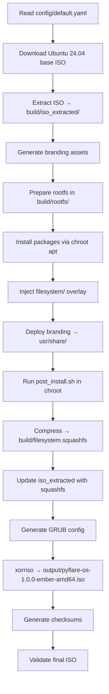

# AppSuite Ecosystem — Build Pipeline

**Version:** 1.0.0 | **Status:** Production | **Author:** Aachman Studios | **Last Updated:** 2026-08-04

---

## Table of Contents

1. [Overview](#overview)
2. [Build Requirements](#build-requirements)
3. [Build Entry Point](#build-entry-point)
4. [Pipeline Stages](#pipeline-stages)
5. [Branding Generation Stage](#branding-generation-stage)
6. [Filesystem Assembly Stage](#filesystem-assembly-stage)
7. [ISO Generation Stage](#iso-generation-stage)
8. [Build Configuration](#build-configuration)
9. [Build Artefacts](#build-artefacts)
10. [Validation Integration](#validation-integration)
11. [CI/CD](#cicd)
12. [Related Documents](#related-documents)

---

## Overview

The PyFlare OS build pipeline transforms three inputs — a brand configuration file, a package manifest, and a filesystem overlay — into a bootable ISO image.

**Build host requirement:** Ubuntu 24.04 LTS (or compatible Debian-based Linux). The build cannot run on Windows or macOS because it requires chroot, mksquashfs, and xorriso.

---

## Build Requirements

### System Packages

```bash
sudo apt install -y \
    squashfs-tools \          # mksquashfs/unsquashfs
    xorriso \                 # ISO generation
    grub-pc-bin \             # BIOS GRUB
    grub-efi-amd64-bin \      # UEFI GRUB
    mtools \                  # EFI partition manipulation
    dosfstools \              # FAT filesystem tools
    python3 \
    python3-pip \
    libcairo2-dev \           # cairosvg dependency
    git
```

### Python Dependencies

```bash
pip install -r PyFlare/requirements.txt
# Pillow>=10.0.0, cairosvg>=2.7.0, tqdm>=4.66.0,
# colorama>=0.4.6, pyyaml>=6.0.2, requests>=2.31.0,
# numpy>=1.26.0, imageio>=2.33.0, imageio-ffmpeg>=0.4.9,
# icnsutil>=1.1.0
```

### Disk Space

| Stage | Approximate Size |
|---|---|
| Ubuntu base ISO | ~1.8 GB |
| Extracted ISO | ~2.5 GB |
| Rootfs (with packages) | ~4–6 GB |
| SquashFS compressed | ~1.5–2 GB |
| Final ISO | ~1.8–2.5 GB |
| **Total workspace** | **~10–13 GB** |

---

## Build Entry Point

```bash
# Full build
sudo python3 PyFlare/build.py --config PyFlare/config/default.yaml

# Branding only
python -m branding_generator.main generate
python -m branding_generator.main validate

# Validation only
python PyFlare/validation/run_all.py

# Clean build artefacts
python PyFlare/scripts/clean.py
```

`build.py` is the master orchestrator (39 KB). It imports and calls the scripts in `PyFlare/scripts/` in sequence.

---

## Pipeline Stages



### Stage Details

| Stage | Script | Description |
|---|---|---|
| 1. Config load | `build.py` | Parse `config/default.yaml`, validate schema |
| 2. Base download | `scripts/download_base.py` | Fetch Ubuntu live-server ISO with mirror fallback |
| 3. ISO extract | `scripts/extract_iso.sh` | Mount + copy ISO contents to `build/iso_extracted/` |
| 4. Branding gen | `branding_generator/main.py` | Run all 16 branding modules |
| 5. Rootfs prep | `scripts/prepare_rootfs.py` | Copy base squashfs, unsquashfs to `build/rootfs/` |
| 6. chroot setup | `scripts/chroot_manager.py` | Bind-mount proc/sys/dev, enter chroot |
| 7. APT install | `scripts/setup_tree.py` | apt-get install all packages from `packages.yaml` |
| 8. Snap install | `scripts/setup_tree.py` | Install snap packages |
| 9. Flatpak | `scripts/setup_tree.py` | Install Flatpak + Flathub apps |
| 10. Overlay inject | `scripts/setup_tree.py` | Copy `filesystem/` into rootfs |
| 11. Branding deploy | `scripts/copy_branding.py` | Deploy `branding/` into `usr/share/` |
| 12. Post-install | `config/post_install.sh` | Plymouth, GRUB, dconf, theme activation |
| 13. SquashFS | `scripts/build_iso.py` | `mksquashfs build/rootfs build/filesystem.squashfs -comp xz -Xbcj x86` |
| 14. ISO assemble | `scripts/package_iso.py` | Replace casper/filesystem.squashfs in iso_extracted |
| 15. GRUB config | `scripts/build_iso.py` | Generate GRUB2 config with PyFlare branding |
| 16. ISO generate | `scripts/generate_iso.sh` | `xorriso` with BIOS+UEFI support |
| 17. Checksums | `scripts/generate_checksums.py` | SHA256 + MD5 |
| 18. Manifest | `scripts/generate_manifest.py` | Build manifest JSON |

---

## Branding Generation Stage

**Script:** `branding_generator/main.py`

Modules are executed in dependency order:

```
1. config.py       → Load tokens from config/branding.yaml
2. utils.py        → Initialise Cairo drawing context
3. themes.py       → GTK3/4 CSS, GNOME Shell CSS
4. icons.py        → SVG generation + PNG rasterisation
5. wallpapers.py   → 4K PNG generation
6. cursors.py      → Xcursor format generation
7. fonts.py        → Font manifest
8. animations.py   → Plymouth script
9. sounds.py       → Sound schema
10. exporters.py   → ICO/ICNS/WebP cross-format export
11. manifest.py    → manifest.json
12. previews.py    → Preview PDFs/PNGs
13. extras.py      → Badges, social cards, favicons
14. docs.py        → Auto-generated brand documentation
15. validator.py   → Post-generation validation pass
```

Output: `branding/` with 24 sub-directories and 800+ files.

---

## Filesystem Assembly Stage

**Script:** `scripts/setup_tree.py` (102 KB — the largest script)

This script builds the complete rootfs by:

1. Starting from the extracted Ubuntu squashfs
2. Entering a chroot environment (bind-mounting /proc, /sys, /dev, /dev/pts)
3. Running `apt-get update && apt-get install` for all packages in `config/packages.yaml`
4. Removing debloat packages (thunderbird, default games, apport, whoopsie)
5. Installing snap packages via `snap install`
6. Installing Flatpak and adding Flathub remote
7. Installing custom packages via `pip3 install`
8. Installing Ollama via official install script
9. Copying the `filesystem/` overlay into the rootfs
10. Setting file permissions and ownership
11. Running `config/post_install.sh` for final configuration

---

## ISO Generation Stage

**Script:** `scripts/generate_iso.sh`

```bash
xorriso \
    -as mkisofs \
    -iso-level 3 \
    -full-iso9660-filenames \
    -volid "PyFlare-OS-1.0" \
    -appid "PyFlare OS Live/Install DVD" \
    -publisher "Aachman Studios" \
    -preparer "PyFlare Build System" \
    -eltorito-boot boot/grub/i386-pc/eltorito.img \
    -no-emul-boot \
    -boot-load-size 4 \
    -boot-info-table \
    --grub2-boot-info \
    --grub2-mbr /usr/lib/grub/i386-pc/boot_hybrid.img \
    -eltorito-catalog boot.catalog \
    -eltorito-alt-boot \
    -e EFI/efiboot.img \
    -no-emul-boot \
    -isohybrid-gpt-basdat \
    -append_partition 2 28732ac11ff8d211ba4b00a0c93ec93b EFI/efiboot.img \
    -output output/pyflare-os-1.0.0-ember-amd64.iso \
    build/iso_extracted/
```

The resulting ISO is hybrid (bootable from USB via `dd` or `cp` without additional tooling).

---

## Build Configuration

**File:** `config/default.yaml`

Key parameters:

```yaml
os:
  version: "1.0.0"
  codename: "Ember"
  iso_name: "pyflare-os-1.0.0-ember-amd64.iso"
  base: "ubuntu"
  base_version: "24.04"

build:
  compression: "xz"
  compression_level: 9
  output_folder: "output"
  work_folder: "build"
  efi_boot: true
  legacy_bios: true
  secure_boot: false
```

---

## Build Artefacts

| Artefact | Location | Notes |
|---|---|---|
| Base ISO (cached) | `build/` | Downloaded once, reused |
| Extracted ISO | `build/iso_extracted/` | Working directory |
| Rootfs | `build/rootfs/` | Assembled root filesystem |
| SquashFS | `build/filesystem.squashfs` | Compressed rootfs (207 MB) |
| Final ISO | `output/pyflare-os-*.iso` | Deliverable |
| SHA256 checksum | `output/*.sha256` | Integrity verification |
| Build manifest | `output/manifest.json` | Build metadata |

All build artefacts are gitignored. The `build/` and `output/` directories should never be committed.

---

## Validation Integration

Before the final ISO is packaged, all 14 validators are run:

```bash
python PyFlare/validation/run_all.py
```

If any validator fails, the build is aborted. Validators check:
branding assets, filesystem structure, desktop entries, YAML/JSON schemas, SVG validity, GTK theme completeness, Plymouth theme, GRUB config, systemd units, file permissions, package manifests, wallpaper resolutions, icon theme, and JSON parse validity.

---

## CI/CD

**Location:** `PyFlare/.github/workflows/`

GitHub Actions pipelines:

| Workflow | Trigger | Steps |
|---|---|---|
| `validate.yml` | Push, PR | Run all 14 validators |
| `build.yml` | Tag push | Full ISO build (Linux runner) |
| `lint.yml` | Push, PR | Python linting (ruff/flake8) |

The full ISO build workflow runs on a self-hosted Linux runner (Ubuntu 24.04) with 20 GB+ disk space. GitHub-hosted runners do not have sufficient disk space for the full pipeline.

---

## Related Documents

| Document | Purpose |
|---|---|
| [ARCHITECTURE.md](ARCHITECTURE.md) | System architecture |
| [BOOT_PROCESS.md](BOOT_PROCESS.md) | What the ISO does when booted |
| [BRANDING.md](BRANDING.md) | Branding generator detail |
| [FILESYSTEM.md](FILESYSTEM.md) | Filesystem overlay |
| [PACKAGE_SYSTEM.md](PACKAGE_SYSTEM.md) | Package manifest detail |
| [INSTALLER.md](INSTALLER.md) | Calamares installer |
| [TESTING.md](TESTING.md) | Validation suite |
