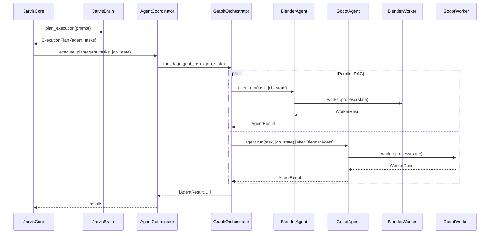

# AppSuite Ecosystem — Multi-Agent Orchestration

**Version:** 1.0.0 | **Status:** Production | **Author:** Aachman Studios | **Last Updated:** 2026-08-04

---

## Overview

AppSuite Jarvis coordinates multiple specialized AI agents to complete complex engineering tasks. The coordination layer sits between the `JarvisBrain` (which plans) and the `GraphOrchestrator` (which executes), mapping abstract task descriptions to concrete agent implementations.

---

## Agent Coordination Flow



---

## AgentTask Structure

Every task in the DAG is an `AgentTask`:

```python
@dataclass
class AgentTask:
    task_id: str              # Unique identifier
    agent_type: str           # "BlenderAgent", "GodotAgent", etc.
    objective: str            # Natural language description
    dependencies: list[str]   # task_ids that must complete first
    priority: int             # Higher = scheduled first
    estimated_duration_seconds: float  # Scheduling hint
    context: dict             # Agent-specific parameters
```

`dependencies` defines the DAG edges. `GraphOrchestrator` only starts a task when all its dependencies are in `completed_tasks`.

---

## Registered Agents

| Agent Type | Module | Delegates to Worker |
|---|---|---|
| `AssetAgent` | `agents/asset_agent.py` | `InternetWorker` |
| `BlenderAgent` | `agents/blender_agent.py` | `BlenderWorker` |
| `BrowserAgent` | `agents/browser_agent.py` | `InternetWorker` (web mode) |
| `CodeAgent` | `agents/code_agent.py` | `CodeWorker` |
| `GodotAgent` | `agents/godot_agent.py` | `GodotWorker` |
| `AnalysisAgent` | `v2_specialists.py` | `AnalysisWorker` |
| `ValidationAgent` | `v2_specialists.py` | `ValidationWorker` |
| `DeployAgent` | `v2_specialists.py` | `DeployWorker` |

Agents are registered with `GraphOrchestrator.add_node(agent_type, agent_instance)`.

---

## Message Bus

`agents/message_bus.py` — lightweight pub/sub for agent-to-agent communication:

```python
bus = MessageBus()
bus.publish("asset_ready", {"path": "/path/to/asset.glb"})
bus.subscribe("asset_ready", callback_fn)
```

This allows the `BlenderAgent` to announce that assets are ready before `GodotAgent` begins importing them.

---

## Supervisor

**File:** `appsuite/core/supervisor.py` (15 KB)

`Supervisor` is the outer job scheduling loop. It runs in a background thread and:

1. Polls the job queue for new jobs
2. Checks resource availability via `JarvisCore.can_schedule()`
3. Calls `JarvisCore.run(prompt)` for each job
4. Handles timeouts and cleanup

The Supervisor is started by `AppContext.start()` and stopped by `AppContext.shutdown()`.

---

## Worker Scoring

`GraphOrchestrator.run_dag()` accepts `worker_scores: dict[agent_type, float]`. These are populated by `core/worker_scorer.py` based on historical task completion rates per agent type.

Higher-scoring agents are prioritised in the scheduling sort:

```python
priority_score = task.priority + worker_scores.get(task.agent_type, 0.0) - (task.estimated_duration_seconds / 120.0)
```

---

## Related Documents

| Document | Purpose |
|---|---|
| [AI_ARCHITECTURE.md](AI_ARCHITECTURE.md) | Full AI system |
| [ENGINE.md](ENGINE.md) | GraphOrchestrator detail |
| [PLUGIN_SYSTEM.md](PLUGIN_SYSTEM.md) | Extending with plugins |
