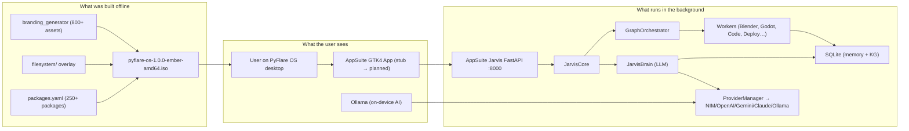

# AppSuite Ecosystem — Repository Walkthrough

**Version:** 1.0.0 | **Status:** Production | **Author:** Aachman Studios | **Last Updated:** 2026-08-04

---

## Table of Contents

1. [Start Here](#start-here)
2. [How Everything Connects](#how-everything-connects)
3. [PyFlare OS Walkthrough](#pyflare-os-walkthrough)
4. [AppSuite Jarvis Walkthrough](#appsuite-jarvis-walkthrough)
5. [LangGraph Walkthrough](#langgraph-walkthrough)
6. [Dependency Graph](#dependency-graph)
7. [Execution Order](#execution-order)
8. [Build Order](#build-order)
9. [Startup Order](#startup-order)
10. [A Complete Job End-to-End](#a-complete-job-end-to-end)

---

## Start Here

The `Appsuite/` repository contains three projects that are designed to work together but are independently operable:

```
Appsuite/
├── PyFlare/           — The operating system (build it to get a bootable ISO)
├── AppSuite_JarvisV1/ — The AI engine (run it to get an autonomous coding agent)
└── langgraph-main/    — StateGraph library (vendored; Jarvis depends on it)
```

The relationship:
- **PyFlare OS** bundles **Ollama** and an **AppSuite application stub**. The stub connects to the **Jarvis FastAPI server** at `localhost:8000`.
- **Jarvis** uses **LangGraph** for its StateGraph execution model.
- Everything else (branding, filesystem, packages, validators, workers) is self-contained.

---

## How Everything Connects



---

## PyFlare OS Walkthrough

### Entry Point: `config/branding.yaml`

Every single visual element and product string in PyFlare OS traces back to this file. It defines:
- Product name, version, codename
- Company info, URLs
- 11 application sub-products
- Base system (Ubuntu 24.04)
- ISO metadata

### Step 1: Generate Branding

```bash
python -m branding_generator.main generate
```

`branding_generator/main.py` reads `config/branding.yaml`, then calls each of the 16 modules in sequence. Each module writes to a sub-directory of `branding/`.

### Step 2: Validate

```bash
python validation/run_all.py
```

14 validators check that every generated asset, config file, and filesystem path is correct. Any failure stops the build.

### Step 3: Build the ISO

```bash
sudo python3 build.py --config config/default.yaml
```

`build.py` orchestrates:
1. Download Ubuntu 24.04 base ISO (with mirror fallback)
2. Extract into `build/iso_extracted/`
3. Set up chroot rootfs in `build/rootfs/`
4. Install 250+ packages via APT in chroot
5. Copy `filesystem/` overlay into rootfs
6. Deploy `branding/` assets into `usr/share/`
7. Run `config/post_install.sh` (Plymouth, GRUB, dconf)
8. Compress rootfs → `build/filesystem.squashfs`
9. Inject squashfs back into ISO
10. Generate GRUB config with PyFlare theme
11. Run `xorriso` → `output/pyflare-os-1.0.0-ember-amd64.iso`
12. Generate SHA256 checksums

### Step 4: Boot

The resulting ISO boots into a GNOME live session with PyFlare branding. The Calamares installer can then be launched to install to disk.

---

## AppSuite Jarvis Walkthrough

### Entry Point: `appsuite/main.py`

`create_app()` builds `AppContext` which wires all singletons:

```
Database → AssetRegistry → SemanticMemory → TemplateEngine
→ TokenBanker → ProviderManager → HardwareManager
→ JarvisBrain → ProjectManager → Workers (7 types)
→ PluginManager → Pipeline → Supervisor
→ Phase 11 components (EventBus, GoalManager, TaskQueue,
   KnowledgeGraph, BenchmarkEngine, ProjectWorkspace,
   BackgroundScheduler, BugHunter, Dashboard)
→ JarvisCore.wire(all above)
```

Then `AppContext.start()` starts the `Supervisor` and `BackgroundScheduler` threads.

### How a Job Flows

1. **Submit** via POST `/api/v1/jobs` with `{"prompt": "Create a medieval village"}`
2. **`Supervisor`** picks up the job from the queue
3. **`JarvisCore.run(prompt)`** is called
4. **`JarvisBrain.plan_execution(prompt)`** queries memory for prior strategies, generates an `ExecutionPlan` with `agent_tasks` (the DAG)
5. **StateGraph** starts: `initialize_node` → creates Project workspace, loads checkpoint if exists
6. **`execute_node`** → `AgentCoordinator.execute_plan()` → `GraphOrchestrator.run_dag()`
   - Tasks are sorted by priority + worker score
   - Eligible tasks submit to `ThreadPoolExecutor`
   - Each agent calls its worker (e.g. `BlenderAgent` → `BlenderWorker.process()`)
   - Checkpoint saved after each successful task
7. **`reflect_node`** inspects results:
   - All succeeded → `outcome = "success"` → commit to memory
   - Any failed → `failure_memory.log_failure()` → if retries remain → `replan_node`
8. **`replan_node`** calls `JarvisBrain.plan_execution(repair_prompt)` → new agent_tasks → back to `execute_node`
9. **`JarvisCore._remember()`** stores strategy to SQLite
10. **`JarvisResult`** returned to Supervisor → API response to caller

### Configuration Loading

`appsuite/config.py`:
1. Reads `config/default_config.yaml` (base config)
2. Merges `config/user_config.yaml` (user overrides, top-level key merge)
3. Loads `config/providers.json` (LLM provider registry)
4. Loads `config/templates.json` (scene templates: medieval_village, integration_test, generic_scene)
5. Returns `AppConfig` dataclass
6. Calls `config.ensure_dirs()` to create all required directories

---

## LangGraph Walkthrough

`langgraph-main/` is a vendored copy of the LangGraph library. It is not modified.

Key packages used by Jarvis:
- `libs/langgraph/` — provides `StateGraph` class imported as `from appsuite.engine.langgraph_agent import StateGraph`
- `libs/checkpoint/` — provides `BaseCheckpointSaver` (used by `CheckpointManager`)
- `libs/checkpoint-sqlite/` — available but Jarvis uses a custom `CheckpointManager` backed by plain JSON files

The LangGraph `StateGraph` is used to define the 4-node state machine:
```
initialize → execute → reflect → replan → execute (loop)
                              → end (success/maxretries)
```

---

## Dependency Graph

```
User Prompt
    │
    ▼
JarvisCore.run()
    │
    ├──► JarvisBrain ──────► ProviderManager ──► NVIDIA NIM / OpenAI / Gemini / Claude / Ollama
    │    (planning)               │
    │                         TokenBanker
    │
    ├──► SemanticMemory ──────► SQLite (strategy, episodic, failure memory)
    │    (context retrieval)
    │
    ├──► StateGraph (LangGraph)
    │         │
    │         ▼
    │    AgentCoordinator
    │         │
    │         ▼
    │    GraphOrchestrator.run_dag()
    │         │
    │         ├──► InternetWorker ──► Poly Haven API
    │         ├──► AnalysisWorker
    │         ├──► BlenderWorker ───► Blender subprocess
    │         ├──► GodotWorker ─────► Godot 4 subprocess
    │         ├──► CodeWorker ──────► ProviderManager (LLM)
    │         ├──► ValidationWorker
    │         └──► DeployWorker
    │
    ├──► CheckpointManager (crash recovery)
    ├──► EventBus (observability)
    └──► SQLite (job DB, Knowledge Graph)
```

---

## Execution Order

### PyFlare OS Build

```
1. config/branding.yaml               (read)
2. branding_generator/config.py       (token extraction)
3. branding_generator/themes.py       (GTK/GNOME CSS)
4. branding_generator/icons.py        (SVG/PNG)
5. branding_generator/wallpapers.py   (PNG)
6. branding_generator/cursors.py      (Xcursor)
7. branding_generator/fonts.py        (manifests)
8. branding_generator/animations.py   (Plymouth)
9. branding_generator/sounds.py       (schema)
10. branding_generator/exporters.py   (cross-format)
11. branding_generator/manifest.py    (JSON)
12. branding_generator/previews.py    (PDFs)
13. branding_generator/extras.py      (badges, social)
14. branding_generator/docs.py        (auto-docs)
15. branding_generator/validator.py   (post-gen check)
16. validation/run_all.py             (14 validators)
17. scripts/download_base.py          (Ubuntu ISO)
18. scripts/extract_iso.sh            (unpack)
19. scripts/prepare_rootfs.py         (rootfs setup)
20. scripts/setup_tree.py             (APT+overlay+branding)
21. config/post_install.sh            (in chroot)
22. scripts/build_iso.py              (mksquashfs)
23. scripts/package_iso.py            (assemble)
24. scripts/generate_iso.sh           (xorriso)
25. scripts/generate_checksums.py     (SHA256)
26. scripts/generate_manifest.py      (build manifest)
```

### Jarvis Job Execution

```
1. API POST /api/v1/jobs              (receive prompt)
2. Supervisor.start()                 (background thread picks up)
3. JarvisCore.run(prompt)
4. JarvisBrain.plan_execution()       (LLM call to ProviderManager)
5. SemanticMemory.retrieve()          (SQLite vector search)
6. JarvisCore.can_schedule()          (resource check)
7. Database.create_job()              (SQLite write)
8. StateGraph.invoke(initial_state)
   a. initialize_node                 (project setup, checkpoint restore)
   b. execute_node                    (AgentCoordinator → run_dag → workers)
   c. reflect_node                    (inspect results, save checkpoint)
   d. [replan_node → execute_node]*   (if failures, up to max_attempts)
9. JarvisCore._remember()             (SQLite strategy update)
10. Database.update_job(status)       (mark complete/failed)
11. JarvisResult returned             (API response)
```

---

## Build Order (Dependencies)

```
config/branding.yaml
        │
        ▼ consumed by
branding_generator/  →  branding/  →  filesystem/usr/share/
                                  →  installer/ branding assets

config/packages.yaml
        │
        ▼ consumed by
scripts/setup_tree.py  →  build/rootfs/ (APT packages installed)

filesystem/  (overlay)
        │
        ▼ injected into
build/rootfs/

build/rootfs/
        │
        ▼ compressed into
build/filesystem.squashfs

build/iso_extracted/ + build/filesystem.squashfs
        │
        ▼ packed by xorriso into
output/pyflare-os-1.0.0-ember-amd64.iso
```

---

## Startup Order (Boot)

```
UEFI/BIOS firmware
    ↓
GRUB 2 (PyFlare themed menu)
    ↓
Linux kernel (linux-generic-hwe-24.04)
    ↓
initramfs / casper scripts
    ↓
Plymouth boot splash (pyflare theme)
    ↓
systemd (PID 1)
    ↓ activate targets:
    sysinit.target → basic.target → network.target → graphical.target
    ↓
GDM3 display manager (PyFlare login screen)
    ↓
User authenticates → GNOME Shell session
    ↓
dconf system profile applied (PyFlare theme, fonts, wallpaper)
    ↓
XDG autostart:
    pyflare-engine.service (AppSuite Jarvis FastAPI at :8000)
    AI Assistant (Ollama client)
    ↓
User desktop ready
```

---

## A Complete Job End-to-End

**Goal:** "Create a medieval village with 6 houses and 20 trees"

```
1. User types prompt in AppSuite GTK4 app
2. App POSTs to http://localhost:8000/api/v1/jobs
3. Supervisor picks up job from PersistentTaskQueue
4. JarvisCore.run("Create a medieval village with 6 houses and 20 trees")
5. JarvisBrain:
   - Queries strategy_memory: finds prior "medieval_village" execution
   - Matches template: "medieval_village" (house×6, barrel×10, tree×20, road×1, npc×8)
   - Generates ExecutionPlan with agent_tasks:
     [AssetAgent(search houses), AssetAgent(search trees), BlenderAgent, GodotAgent, ValidationAgent, DeployAgent]
     with dependencies: Blender depends on Asset, Godot depends on Blender, etc.
6. StateGraph.initialize_node: create Project("job-abc123", output_dir)
7. StateGraph.execute_node:
   AgentCoordinator → GraphOrchestrator.run_dag():
   - [parallel] AssetAgent×2 → InternetWorker → Poly Haven API
     → download house.glb, tree.glb into assets/
   - [sequential] BlenderAgent → BlenderWorker
     → subprocess: blender --background --python compose_scene.py
     → generates medieval_village.blend + export medieval_village.glb
   - [sequential] GodotAgent → GodotWorker
     → creates Godot project, imports .glb, generates scene.tscn
   - [parallel] ValidationAgent → ValidationWorker
     → checks scene has 6 houses, 20 trees, valid .tscn
   - [sequential] DeployAgent → DeployWorker
     → packages project, deploys to localhost endpoint
8. StateGraph.reflect_node: all tasks succeeded → outcome="success"
9. JarvisCore._remember(): stores strategy to strategy_memory SQLite
10. Database.update_job(status="completed")
11. JarvisResult(
      job_id="abc123", status="success",
      godot_project="output/abc123/medieval_village/",
      main_scene="output/abc123/medieval_village/scenes/main.tscn",
      asset_count=31, duration_seconds=118.4
    )
12. AppSuite GTK4 app displays: "✅ Job complete — Open in Godot"
```

---

## Related Documents

| Document | Purpose |
|---|---|
| [ARCHITECTURE.md](ARCHITECTURE.md) | System architecture |
| [AI_ARCHITECTURE.md](AI_ARCHITECTURE.md) | Jarvis deep dive |
| [ENGINE.md](ENGINE.md) | GraphOrchestrator |
| [BUILD_PIPELINE.md](BUILD_PIPELINE.md) | Build system |
| [BOOT_PROCESS.md](BOOT_PROCESS.md) | Boot sequence |
